##MAV simulation projects

 This is the repository about the implementation of projects in 'Small unmanned aircraft' textbook. This is the code I submitted for the assignment at the UAV Navigation & Control Course. You can simply get the original source about this projects in [here](http://uavbook.byu.edu/doku.php). Check out the YouTube video here to see the correct results for the simulation. You can also get a texbook pdf file. I have put some of the project results I have implemented below. (But, report is not attached)

### Chapter 2.

I designed the MAV by imitating The'Lockheed F-117 Nighthawk'.

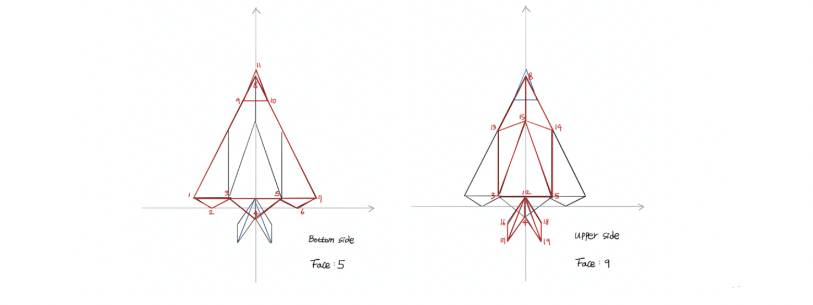

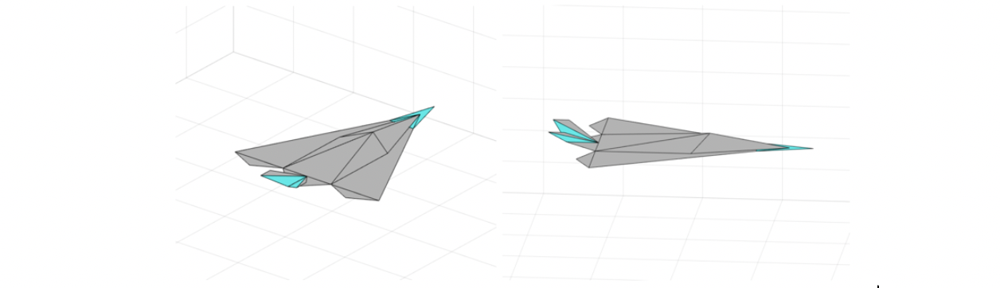

### Chapter 3.

I set the equation of motion in the Matlab, and confirmed that the MAV worked correctly.

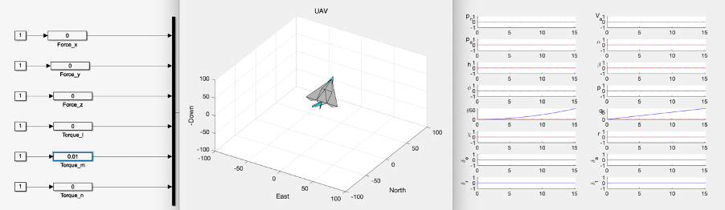

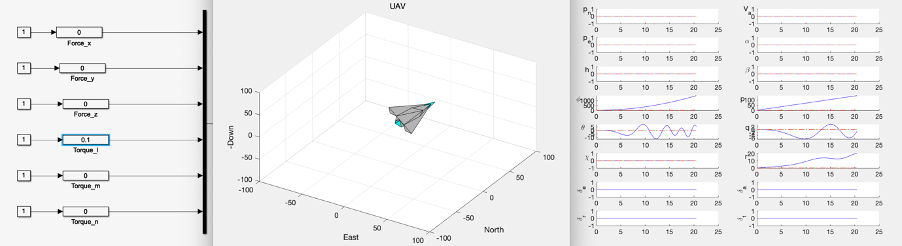

### Chapter 4.

The formula for external forces and moments is applied to the operation of MAV. Light turbulence (left) and moderate turbulence (right) results can also be found within the simulation.

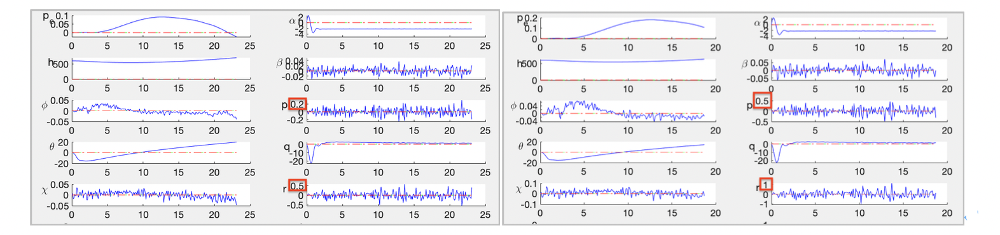

### Chapter 5.

In this chapter, the equations of motion for MAV are simplified by trim conditions. Through this, transfer function and state-space equation are applied to the model for lateral and longitudinal motion.

### Chapter 6.

The autopilot was designed in this chapter. There are several autopilot design methods, but I used a successive loop closure using a feedback control method referred below.

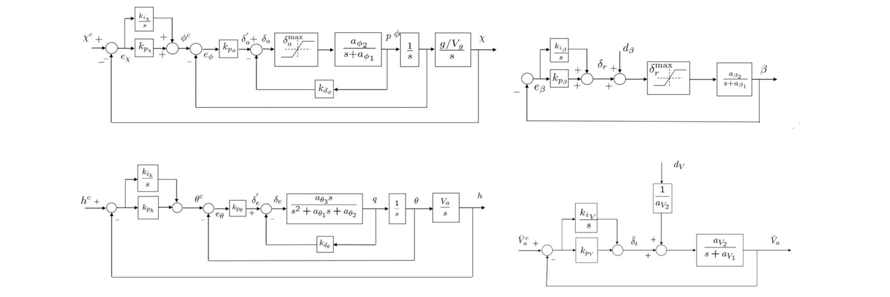

### Chapter 7.

I add a sensor to the simulation model of MAV. Sensors include inertial measurement unit such as accelerometers and rate gyros, pressure sensors, GPS, etc. 

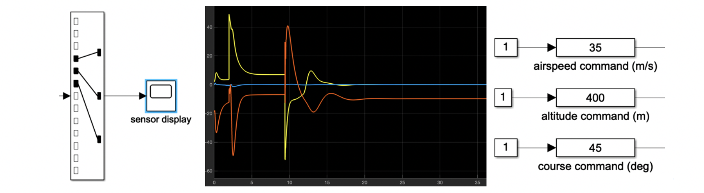

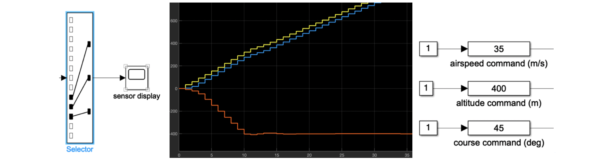

### Chapter 9.

 I designed MAV as a linear system in the previous chapter, but this chapter covers nonlinear design models. 

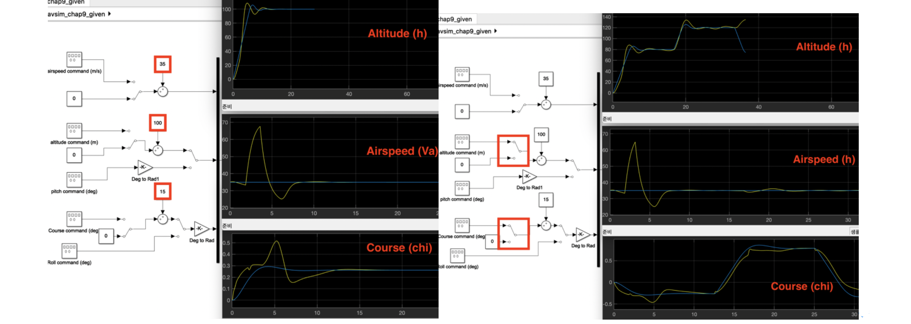

### Chapter 10.

Our task in this chapter is to complete the path following algorithm. The algorithm3 of the textbook is straight line following and the algorithm4 is orbit following. Depending on the value of the flag, the MAV is controlled using the straight-line strategy or orbit strategy. 

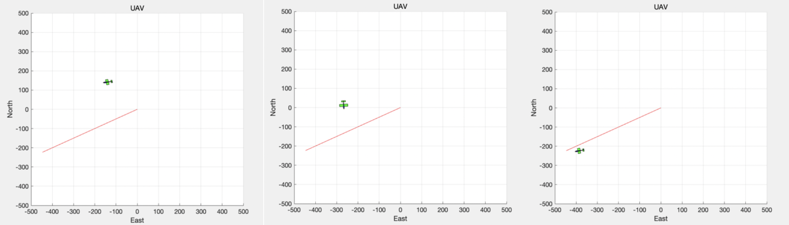

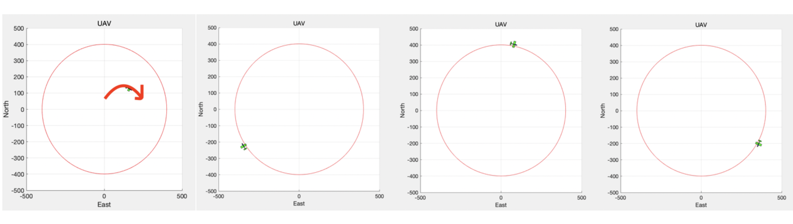

### Chapter 11.

I implemented the path manager in this chapter. Assume MAV has two actions: straight-line follow and orbit follow. The most basic use the b-ball around waypoint method and half-plane through waypoint. I supplement this with fillet smoothing.

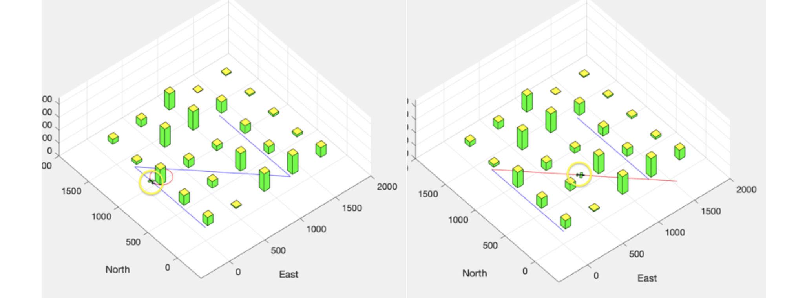

I didn't implement the code of chapter 12.